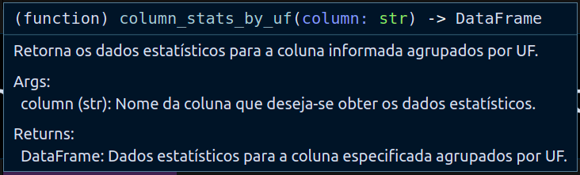
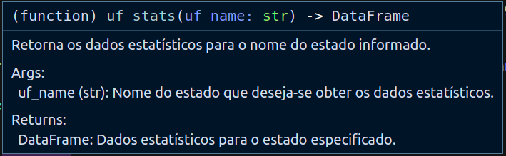
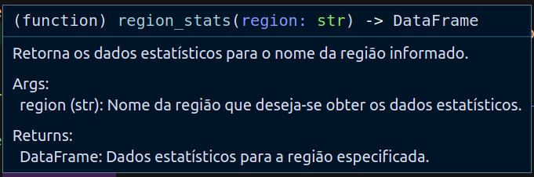
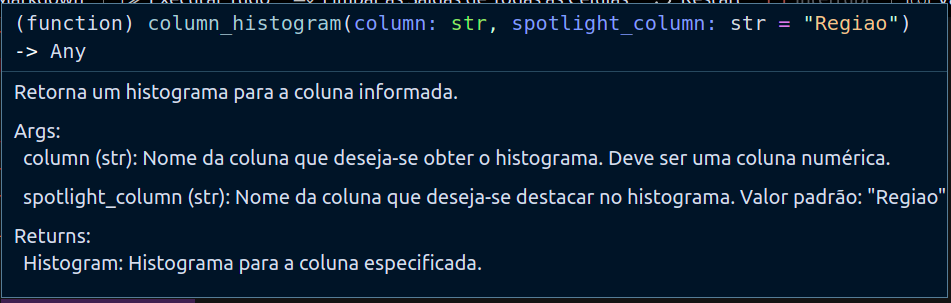
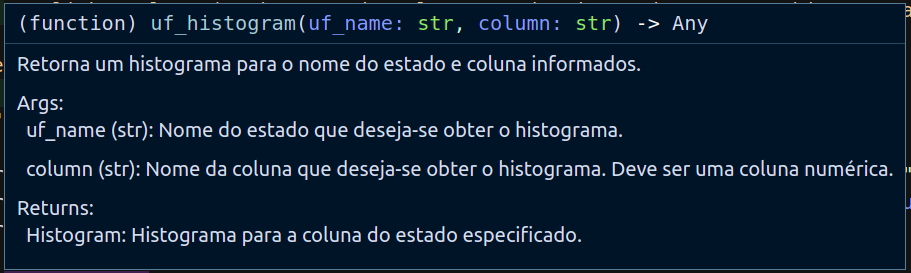
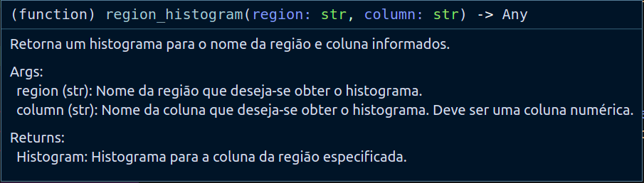

# Boas vindas ao **Levantamento dos resultados do Concurso do Banco do Brasil 2022!**

Para executar o projeto, observe as orientações descritas a seguir, e se tiver qualquer dúvida, sugestão, contribuição, considere abrir uma issue ou entrar em contato. 🚀

Aqui você vai encontrar os detalhes de como está estruturado e foi desenvolvido o levantamento.

# Desenvolvimento

  
<strong>Objetivo</strong>
 

  O **objetivo** é fazer a extração e tratamento dos dados do resultado final do concurso para o cargo de Agente Comercial, **um arquivo pdf**, limpando e transformando os dados em **csv**, gerando **interface de visualização** através do pivottablejs e habilitando análise dos dados com algumas **funções de análise pré definidas**.

  Para isso, **foi consultado no site da Cesgranrio**, banca organizadora do concurso, o resultado final divulgado em 14 de julho de 2023 ([TAC - Agente Comercial](https://www.cesgranrio.org.br/pdf/bb0122/BB0122_TAC_13062023_AGENTE_COMERCIAL.pdf)).

  ---

  
<strong>Estrutura do projeto</strong>
 

  * **Na pasta [src](src) estão os diretórios:**
    * **[data](src/data)** com o arquivo de origem dos dados do resultado do concurso.
    * **[notebooks](src/notebooks)** com os notebooks que executam a extração, tratamento e disponibilização dos dados trabalhados **([transformation](src/notebooks/transformation.ipynb))**, e o código que constrói algumas funções pré definidas para análise descritiva dos dados **([analysis](src/notebooks/analysis.ipynb))**.
  * **Na pasta views estão os arquivos:**
    * **([bb_2023_report.csv](views/bb_2023_report.csv))**, csv gerado com o consumo dos dados; 
    * **([bb_2023_views.html](views/bb_2023_views.html))**, arquivo html que permite a visualização gráfica dos dados em uma página web.

  ---

  
<strong>Tecnologias utilizadas</strong>
 

  O projeto foi desenvolvido em Python, com o script de ETL construído em Jupyter Notebook através da [extensão Jupyter do Vs Code](https://marketplace.visualstudio.com/items?itemName=ms-toolsai.jupyter)*.

  Para o processamento dos dados, essas foram as bibliotecas utilizadas:

  * **[Pandas](https://pandas.pydata.org/):**
    * Ferramenta open source focada na facilidade para manipulação e análise de dados, totalmente integrada com a linguagem python
  * **[Pivot Table JS](https://github.com/nicolaskruchten/jupyter_pivottablejs):**
    * Módulo usado no jupyter notebook que cria uma interface gráfica para manipulação e criação de visualizações à partir de tabelas dinâmicas.
  * **[Plotly](https://plotly.com/python/):**
    * Biblioteca python para construção de gráficos interativos e de qualidade.
  * **[Tabula](https://tabula-py.readthedocs.io/en/latest/):**
    * É uma pacote que adapta para o python a biblioteca **tabula-java**, usado na leitura de tabelas PDF, convertendo-as por padrão em  dataframes pandas.

  *No arquivo de dependências [dev-requirements.txt](dev-requirements.txt) é listada a versão compatível com o projeto da biblioteca **jupyter**. Caso prefira executar o projeto localmente, apague a hashtag (#) em **_#jupyter==1.0.0_** antes da instalação das dependências demonstrada abaixo.

---
    
# Orientações

  
<strong>Requisitos para execução</strong>
 

  É necessária a instalação prévia do **python** e do gerenciador de pacotes **pip** para os passos a seguir.

  O projeto foi construído com o **python na versão 3.8**, porém não se espera indisponibilidades da sua execução em versões posteriores nem à partir da versão 3.4. Qualquer incompatibilidade com a versão da sua máquina por favor informe.

  
<strong>Construindo um ambiente Python</strong>
 

  Para controlar o impacto da instalação das dependências do projeto, recomenda-se fortemente a construção de um ambiente python, que encapsula as instalações feitas.

  Com o python instalado na sua máquina, abra o terminal dentro da pasta clonada do projeto **concurso_bb_2022**, e execute o seguinte comando:

  `python3 -m venv concurso_bb_2022`

  Para ativar o ambiente no terminal, execute o seguinte comando:

  `source concurso_bb_2022/bin/activate` **(para terminal Linux ou Mac)**

  ou

  `source concurso_bb_2022\bin\activate` **(para terminal Windows)**

  ---

  
<strong>Instalando as dependências do projeto</strong>
 

  O arquivo dev-requirements lista as dependências utilizadas na construção desse projeto (versões das bibliotecas) e que devem ser instaladas para execução do código. 
  Tendo o python e o pacote pip instalado na sua máquina, e após a ativação do ambiente python caso tenha feito, na pasta **concurso_bb_2022** que é resultado do clone do repositório, execute o seguinte comando:

  `pip install -r dev-requirements.txt` 

  Com a instalação feita, é possível executar o notebook de análise para gerar as estatísticas do seu interesse.

---

# Implementações

  
<strong>Consumindo os dados transformados</strong>
 

  Como resultado da transformação, são gerados os arquivos [**bb_2023_report.csv**](views/bb_2023_report.csv) e [**bb_2023_views.html**](views/bb_2023_views.html) que tem respectivamente os dados limpos e uma interface gráfica para exploração dos resultados.

  **Ps:** O arquivo **bb_2023_report.csv** é separado por ponto e vírgula ( ; ). Considere essa estrutura para consumo do arquivo.

  ---

  
<strong>Utilizando funções de análise pré-definidas</strong>
    

  O notebook [analysis.ipynb](src/notebooks/analysis.ipynb) implementa funções de análise descritiva dos dados e exemplifica seu uso. 
  
  A descrição das funções são apresentadas abaixo:

  * ## **Análise dos dados:**

    * **Imagem 01 - Estatísticas por coluna.**
    

    * **Imagem 02 - Estatísticas por estado.**
    

    * **Imagem 03 - Estatísticas por região.**
    

  * ## **Visualização dos dados:**

    * **Imagem 04 - Visualização por coluna.**
    

    * **Imagem 05 - Visualização por estado.**
    

    * **Imagem 06 - Visualização por região.**
    

---

  
<strong>Próximos passos</strong>
 

  As features mapeadas são:

  * **Adotar o paradigma POO** para processamento dos dados coletados, utilizando o TDD para garantir o design da aplicação;

  * **Construir uma esteira de CI/CD** para garantir a governança das implementações do projeto;

  * **Orquestrar o ambiente com Kubernetes**, garantido a escala e disponibilidade da execução do projeto para qualquer usuário.

  ---

